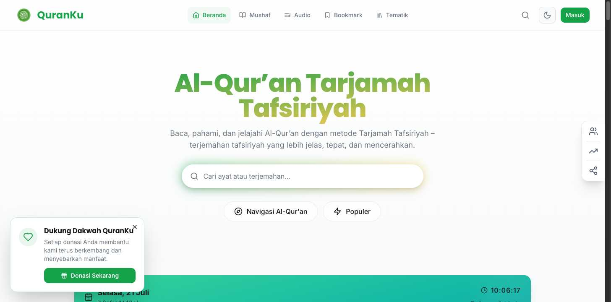

# DESIGN.md: QuranKu (quran.tarjamahtafsiriyah.com)

## Source
- URL: https://quran.tarjamahtafsiriyah.com/ (homepage)
- Capture date: 2026-07-21
- Evidence: live-site `getComputedStyle` on `:root` + key elements (exact values), a full-page reference
  screenshot, and the prior extraction docs in this folder (`design-tokens.md`, `components.md`,
  `PAGE_TOPOLOGY.md`, `assets.md`).
- Tooling note: the `firecrawl-website-design-clone` skill was invoked, but Firecrawl was not available
  (no CLI, no `FIRECRAWL_API_KEY`). Extracted via **Interceptor** instead — reading the actual rendered
  CSS, which is higher fidelity than Firecrawl's heuristic `branding` block for a token/component clone.

## Reference Screenshot

Visual source of truth for layout, hierarchy, density, and feel. Tokens below describe the same page
in machine-readable form. (Above-the-fold capture; the page continues into a teal prayer-times panel,
topic chips, a "today's topic" card, then a 114-card surah grid — see Page Patterns.)

## Design Summary

A calm, editorial Islamic reading app. **shadcn/ui + Tailwind**, light theme only on the public site.
The look is: cool near-white background, **white cards outlined by hairline `#DCE0E5` borders over almost
no shadow**, a single loud brand color — **emerald `#16A249`** — used for CTAs, active states, and number
badges (at 10% tint), with **gold `#EFC851`** held back as a quiet secondary. Headings and surah names are
**Poppins** (600–800); everything else is **Inter** (400–500); Arabic is an **Uthman Naskh** stack. Generous
12px radii, a 1280px content column, and a fixed translucent blurred header. Restraint over decoration: the
design leans on borders and type, not shadows or gradients — except one flourish, the hero title's
emerald→gold two-tone.

## Design Tokens

> QuranKu stores tokens as HSL triples (`H S% L%`) consumed via `hsl(var(--token))`. Hex added for reference.
> Values are verbatim from the live `:root` (light theme — the only theme shipped publicly).

### Colors

| Role | Token | HSL | Hex ≈ |
|---|---|---|---|
| Page background | `--background` | `210 20% 98%` | `#F7F9FA` |
| Primary ink | `--foreground` | `224 10% 10%` | `#17181C` |
| Card surface | `--card` | `0 0% 100%` | `#FFFFFF` |
| **Brand / emerald** | `--primary` | `142 76% 36%` | `#16A249` |
| On-emerald | `--primary-foreground` | `0 0% 100%` | `#FFFFFF` |
| **Secondary / gold** | `--secondary` | `45 84% 63%` | `#EFC851` |
| On-gold | `--secondary-foreground` | `142 76% 15%` | `#0A4021` |
| Muted surface | `--muted` / `--accent` | `210 16% 93%` | `#E9ECF0` |
| Muted / secondary text | `--muted-foreground` | `210 9% 46%` | `#6B7580` |
| Hairline border / input | `--border` / `--input` | `210 15% 88%` | `#DCE0E5` |
| Focus ring (brighter emerald) | `--ring` | `142 76% 46%` | `#22C55E` |
| Error | `--destructive` | `0 84% 60%` | `#EF4444` |

**Brand flourish gradient** (emerald → teal → cyan): `#34D399` → `#14B8A6` → `#0891B2`. A cool sweep.
**Hero title gradient** (observed, separate): a two-tone **emerald → gold** clipped over the display text
("Al-Qur'an Tarjamah" emerald, "Tafsiriyah" gold).

### Typography

| Family | Where | Weights |
|---|---|---|
| **Poppins** | all headings (`h1`–`h3`), surah names — the display face | 600–800 |
| **Inter** | body, nav, buttons, inputs, subtitles — the UI face | 400–500 |
| **Uthman Naskh** | Arabic ayat / surah script (`--arabic-font-family`) | — |

Arabic fallback stack: Uthman Hafs → Noto Naskh Arabic → Scheherazade New → Lateef → Amiri → serif.
Fonts are self-hosted / bundled (no Google Fonts `<link>`). Recommended web fallbacks if you can't
bundle: Poppins → `"Poppins", system-ui, sans-serif`; Inter → `"Inter", system-ui, sans-serif`.

Type scale (measured computed values):

| Element | Family | Size | Weight | Line-height | Tracking | Color |
|---|---|---|---|---|---|---|
| Hero `h1` | Poppins | 60px | 800 | 60px | −1.5px | `#17181C` (gradient-clipped variant on title) |
| Section `h2` | Poppins | 20px | 700 | 28px | normal | `#17181C` |
| Card title `h3` | Poppins | 18px | 600 | 28px | normal | `#17181C` |
| Nav links | Inter | 16px | 400 | 24px | normal | `#17181C` → emerald on hover/active |
| Button / label | Inter | 14px | 500 | 20px | normal | — |
| Card subtitle / body / input | Inter | 14px | 400 | 20px | normal | `#6B7580` / `#17181C` |

### Spacing And Layout

| Constant | Value |
|---|---|
| Content container max-width | **1280px** (`max-w-7xl`); inner prose 896px, search block 576px |
| Base radius | `--radius: 0.75rem` (12px); cards `rounded-xl` = 12px |
| Pills | `9999px` (topic chips, number badges) |
| Buttons | 10px radius |
| Header | 72px tall, `position: fixed`, `z-index: 50` |
| Elevation | `shadow-sm` = `0 1px 2px 0 rgba(0,0,0,0.05)` — very restrained; borders do the work |
| Sidebar width token | `--sidebar-width: 18rem` |

## Components

**Fixed header** — `position: fixed; top:0; z-50; height:72px; background: rgba(255,255,255,0.8);
backdrop-filter: blur(16px); border-bottom: 1px solid rgba(220,224,229,0.8); box-shadow: shadow-sm`.
Layout: logo PNG + wordmark (left) · nav links (center) · Masuk CTA (right).

**Primary button (Masuk)** — `background:#16A249; color:#fff; border-radius:10px; padding:0 12px;
font: Inter 14px/500; border:none`. The canonical solid-emerald button for all primary actions.

**Surah card** (the workhorse, ×114 in a 3-col grid) — `background:#fff; border:1px solid #DCE0E5;
border-radius:12px; box-shadow: shadow-sm; height:184px; padding:24px (p-5 sm:p-6)`. Internals:
a **40px circle number badge** (`background: rgba(22,162,73,0.1)` emerald @10%, `color:#16A249`, fully
round, Inter 14/500) + name block (`h3` Poppins 18/600 ink → emerald on hover; `p` meaning Inter 14/400
`#6B7580`) + Arabic name (Uthman Naskh) + Makkiyah/Madaniyah badge + ayat count.

**Topic chip** — outline pill: `background:#fff; color:#17181C; border:1px solid #DCE0E5;
border-radius:9999px; padding:8px 16px; font: Inter 14px/500`. Lifts to emerald on hover.

**Search bar (hero)** — height 44px, radius 10px, hairline border, emerald focus ring (`#22C55E`),
placeholder "Cari ayat atau terjemahan…", inside a 576px-max inner container.

**Prayer-times panel** — full-width teal→emerald gradient band (below the hero) with date, Hijri date,
a live ticking clock, location, and five prayer-time cells (the active one highlighted white).

## Page Patterns

Single-column scroll page, 1280px content container, fixed header overlay. Section order top→bottom:
1. **Fixed header** (72px, translucent blurred).
2. **Hero** — gradient `h1`, tagline, big search bar, Navigasi/Populer pills.
3. **Navigasi Al-Qur'an** — quick-access panel (Indeks Tematik, Yasin, Al-Waqi'ah, Al-Mulk, Al-Kahfi,
   Ar-Rahman, Ayat Kursi) + a live prayer-times clock + "Populer".
4. **Jelajahi Topik** — outline-pill topic chips.
5. **Topik Al-Qur'an Hari Ini** — a "today's topic" card block.
6. **Daftar Surah** — filter row (Surah/Juz/Urutan Wahyu · sort) then a **114-card, 3-column grid**.
7. **Footer**.

Interaction: static/flow page (no scroll-snap). Header fixed+translucent from load. Live regions
(clock, "Topik Hari Ini", "Populer") load async. Surah-grid filters re-sort the same 114 cards. Cards and
chips hover to emerald. Responsive is Tailwind-driven (`p-5 sm:p-6`, `text-base sm:text-lg`); 3-col grid
collapses to 1–2 col on smaller breakpoints (read from class names, not width-tested).

## Content Style

Indonesian, warm and devotional-but-plain. Product name **QuranKu**; the method is **Tarjamah
Tafsiriyah** ("terjemahan tafsiriyah yang lebih jelas, tepat, dan mencerahkan"). Headings are short noun
phrases ("Akses Cepat", "Jelajahi Topik", "Topik Al-Qur'an Hari Ini"). CTAs are single verbs/nouns
("Masuk", "Donasi Sekarang"). Surah cards pair the Latin name + a one-word Indonesian meaning
("Al-Fatihah" / "Pembukaan"). Sober, respectful, uncluttered.

## Agent Build Instructions

1. **Set the palette**: emerald `#16A249` as the single brand color; ink `#17181C`; cool near-white bg
   `#F7F9FA`; white cards; hairline borders `#DCE0E5`; muted text `#6B7580`; gold `#EFC851` as a *quiet*
   secondary (small accents only, not large fills). Focus ring `#22C55E`.
2. **Type**: Poppins for headings + names (600–800), Inter for everything else (400–500), an Uthman
   Naskh Arabic stack for scripture. Hero `h1` 60px/800 with −1.5px tracking; card titles 18px/600.
3. **Shape language**: 12px radius on cards/inputs, 10px on buttons, full pills for chips + number
   badges. Elevation is **hairline borders over near-zero shadow** (`shadow-sm` at most) — do NOT reach
   for drop shadows.
4. **Layout**: 1280px max content column, fixed 72px translucent blurred header (logo+wordmark · centered
   nav · emerald CTA). Single-column scroll; hero → quick-access + prayer clock → topic chips → today's
   topic → 114-card 3-col surah grid → footer.
5. **Signature card**: white, hairline-bordered, 12px radius, 24px padding, 184px tall, with a **40px
   emerald-10%-tint circular number badge** + Poppins name (→ emerald on hover) + Indonesian meaning.
6. **Restraint**: one loud color, lots of white, type does the hierarchy. The teal→emerald prayer band
   and the emerald→gold hero title are the only two color flourishes; everything else is monochrome-ish.
7. **Icons**: inline SVG (lucide-style), not sprites. **Do not copy QuranKu's logo PNG or trademarks** —
   they are QuranKu's own brand; use your own mark.

## Rerun Inputs
workflow: firecrawl-website-design-clone
source_url: https://quran.tarjamahtafsiriyah.com/
target_stack: framework-agnostic tokens (site is shadcn/ui + Tailwind; New-Quranku demo is vanilla TS/CSS)
output: DESIGN.md
note: Firecrawl unavailable in this environment — extracted via Interceptor computed-CSS + screenshot.
